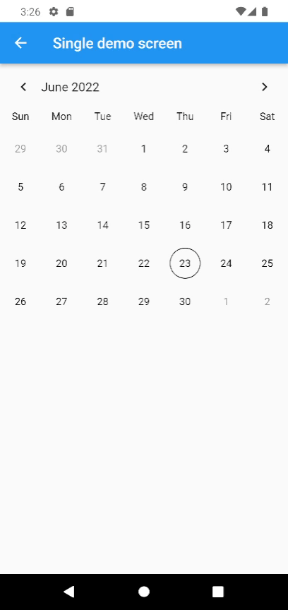
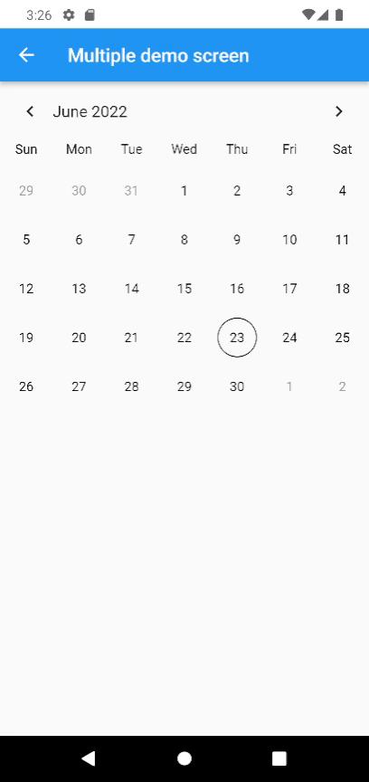
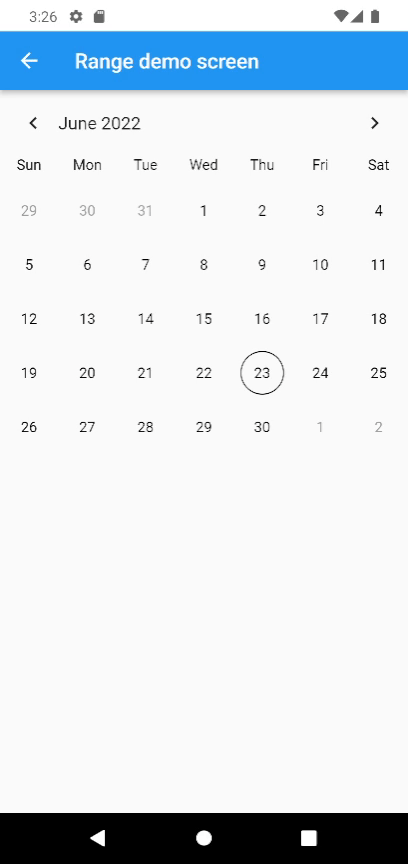

# 📅 flutter_calendar_widget


The flutter_calendar_widget is a flexible and freely changeable calendar of widgets.

Not only can you change the style, but you can also change the widget in the calendar, so you can customize it freely if you want.

# Features

- Supports multiple date selections such as single, range, multiple, etc
- Calendar size changes dynamically depending on content.
- Multilingual translation support.
- Can add calendar navigation header.
- Can change the icon in the navigation header.
- Calendar style can be changed.
- All text in the calendar can be changed.
- Advanced customizable; all widgets in the calendar can be changed.

# Installing

```bash
flutter pub add flutter_calendar_widget
```

# Usage

Make sure to check out [examples](https://github.com/dooboolab/flutter_calendar_widget/tree/main/example) and [API docs](https://pub.dev/documentation/flutter_calendar_widget/latest/) for more details.

## Selection Mode

Depending on the selection mode, you can specify the following three selection methods.

### 1. `CalendarSelectionMode.single` for selecting one date.

Allows to select a single date, selecting a new date will remove the selection for previous date and updates selection to the new selected date.

#### Preview



#### Example

```dart
FlutterCalendar(
    selectionMode: CalendarSelectionMode.single,
    onDayPressed: (DateTime date) {
        print(date);
    }
)
```

### 2. `CalendarSelectionMode.multiple` for selection of multiple dates.

Allows multiple date selection, selecting a new date will not remove the selection for previous dates, allows to select as many dates as possible.

#### Preview



#### Example

```dart
FlutterCalendar(
    selectionMode: CalendarSelectionMode.multiple,
    onMultipleDates: (List<DateTime> dates) {
        for (var date in dates) {
            print(date);
        }
    },
)
```

### 3. `CalendarSelectionMode.range` Allows to select a single range of dates.

#### Preview



#### Example

```dart
FlutterCalendar(
    selectionMode: CalendarSelectionMode.range,
    onRageDate: (CalendarDateRange dateRange) {
        print(
            'start: ${dateRange.start}, end: ${dateRange.end}',
        );
    },
)
```

## How to change style

There are two main ways to style that calendar widget.

### 1. To change the style of text.

You can change the text style by injecting a CalendarTextStyle instance.

#### Example

```dart
FlutterCalendar(
    selectionMode: CalendarSelectionMode.single,
    textStyle: const CalendarTextStyle(
        dayFontSize: 16,
        dayTextColor: Colors.blue,
    ),
)
```

### 2. To change the style except for text.

Styles other than text styles can be changed by injecting an instance of CalendarStyle.

#### Example

```dart

```
